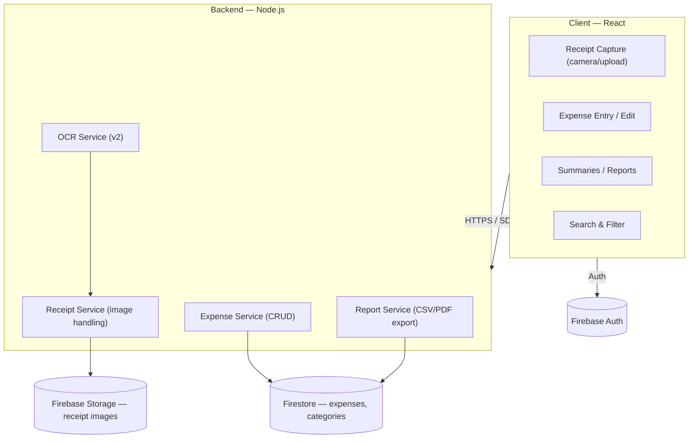
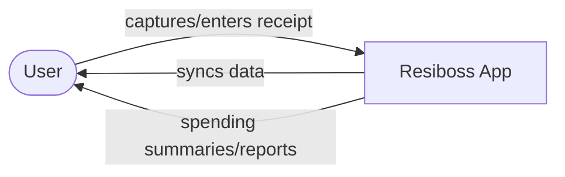
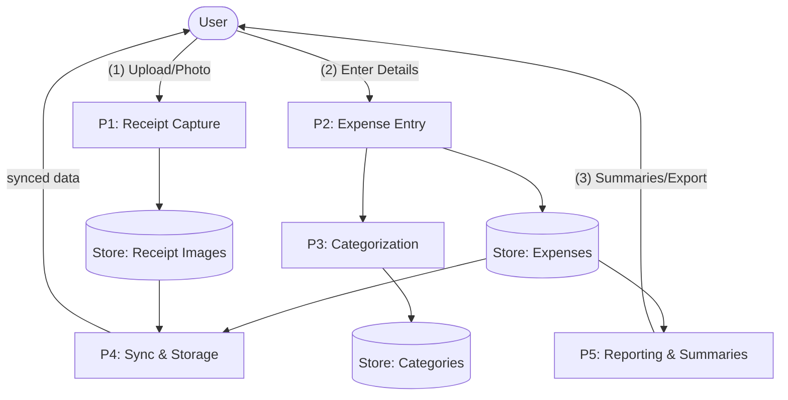
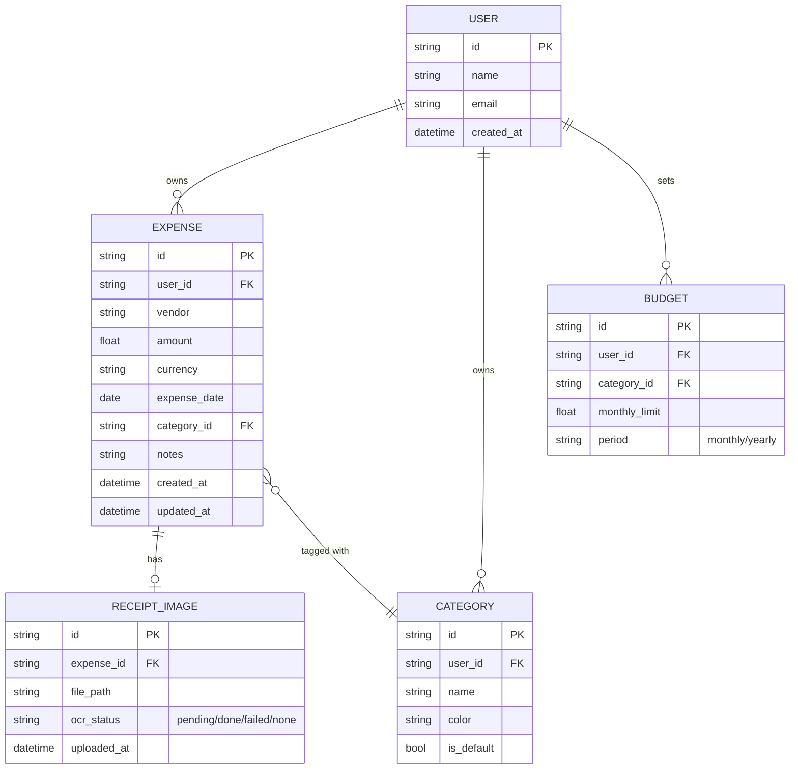

# Resiboss — Project Plan

## 1. Overview
Resiboss is a **receipt and expense tracking app** that helps a user capture, organize, and monitor their spending in one place — turning a shoebox of paper/digital receipts into searchable, categorized, reportable data.

**Primary user:** One person tracking their own personal or small-business expenses (single-user tool — no team/shared workspaces in v1).

**Core loop:**
1. Capture a receipt (photo, upload, or manual entry)
2. Extract/enter the details — vendor, date, amount, category
3. It's saved and synced to the cloud
4. Browse, search, filter, and see spending summaries whenever needed

## 2. Why it's more than "just a receipt scanner"
- **OCR-based capture** — snap a photo and let the app pull vendor, date, and total automatically (v2), instead of typing everything by hand
- **Category tracking** — every expense tagged by category so spending patterns are visible, not just a pile of receipts
- **Spending summaries & reports** — see totals by category, by month, by vendor at a glance
- **Search & filter** — find that one receipt from three months ago in seconds
- **Cloud sync** — capture a receipt on your phone, review it later on desktop, same data everywhere
- **Budget goals & alerts (v2)** — set a monthly budget per category and get warned before overspending
- **Export reports** — pull a CSV/PDF for tax season, reimbursement, or personal records
- **Multi-currency support (v2)** — track spending across currencies for travel or international purchases

## 3. Core Features (v1)
| Feature | Description |
|---|---|
| Receipt capture | Upload a photo or file of a receipt; manual entry as fallback |
| Expense fields | Vendor, date, amount, category, notes per entry |
| Category tracking | Predefined + custom categories, assignable per expense |
| Cloud sync | Firebase-backed storage so data is available across devices |
| Spending summaries | Totals and breakdowns by category and by date range |
| Search & filter | Find past transactions by vendor, category, date, or amount |
| Auth | Basic sign-in so the user's data is tied to their account |
| Receipt gallery | Thumbnail view of stored receipt images tied to each expense |

## 4. Nice-to-Have Features (v2+)
- **OCR-based receipt scanning** — auto-extract vendor/date/total from a photo instead of manual entry
- **Budget goal setting and alerts** — set per-category monthly budgets, get notified when close to/over limit
- **Export reports to CSV/PDF** — for taxes, reimbursement, or bookkeeping
- **Multi-currency support** — log and convert expenses in different currencies
- **Recurring expense detection** — flag subscriptions or repeat vendors automatically
- **Spending insights** — trends over time, month-over-month comparisons, top categories
- **Dark mode**
- **PWA install + offline capture** — snap a receipt with no signal, syncs once back online

**Explicitly out of scope for now:** multi-user/shared household budgets, receipt-sharing with an accountant, bank account/card integration (auto-import of transactions).

## 5. Design Priorities
- **Mobile-first capture, desktop-friendly review**: receipts are usually captured on the go (phone camera), but summaries/reports are often reviewed on a bigger screen
- **Minimal friction on capture**: logging a receipt should take just a few taps — photo, category, save
- **Clarity over density**: spending summaries should be scannable at a glance, not a wall of numbers
- **Consistent categorization**: category picker should be fast (recent/frequent categories surfaced first) so tagging doesn't feel like a chore
- **Distinctive, non-generic visual design**: a deliberate color palette and type system rather than default component styling, so it doesn't read as a bootstrapped template

## 6. Tech Stack
- **Frontend:** React (JavaScript)
- **Styling:** CSS (Tailwind or another framework recommended for consistency, if adopted)
- **Backend:** Node.js
- **Database / Cloud:** Firebase (Firestore for data, Firebase Storage for receipt images, Firebase Auth for sign-in)
- **OCR (v2):** Cloud OCR API (e.g. Google Cloud Vision, or a Firebase Extension) for receipt text extraction
- **Reporting/export (v2):** CSV generation client-side; PDF export via a library (e.g. `pdf-lib` or `jsPDF`)
- **Charts:** A charting library (e.g. Recharts or Chart.js) for spending summaries and trend views

## 7. Open Questions
- [ ] **Receipt capture flow:** Camera capture directly in-app vs. file upload only vs. both?
- [ ] **Category set:** Fixed default categories, fully custom, or a hybrid (defaults + user-added)?
- [ ] **OCR provider:** Which OCR service to use, and how much manual correction UI is needed for low-confidence extractions?
- [ ] **Budgeting scope:** Per-category budgets only, or also an overall monthly budget?
- [ ] **Reporting granularity:** Weekly/monthly/yearly views, custom date ranges, or both?

## 8. Suggested Build Order
1. Auth + basic app shell
2. Manual expense entry (vendor, date, amount, category, notes)
3. Receipt image upload + gallery view tied to expenses
4. Firebase sync across devices
5. Spending summaries (category/date breakdowns)
6. Search & filter
7. Export reports (CSV/PDF)
8. OCR-based capture
9. Budget goals & alerts
10. Multi-currency support

## 9. System Architecture



## 10. Data Flow Diagram (DFD)

**Level 0 (context):**



**Level 1 (major processes):**



## 11. Entity Relationship Diagram (ERD)



## 12. User Stories

**Capturing expenses**
- As a user, I want to upload a photo of a receipt, so I have a digital record of it.
- As a user, I want to manually enter an expense if I don't have a physical receipt, so nothing gets left out.
- As a user, I want the app to extract vendor, date, and total from a photo automatically, so I don't have to type it all in myself.
- As a user, I want to assign a category to each expense, so my spending is organized from the start.

**Reviewing & organizing**
- As a user, I want to see a summary of my spending by category, so I know where my money is going.
- As a user, I want to filter my transactions by date range, category, or vendor, so I can find what I need quickly.
- As a user, I want my data to sync across my devices, so I can capture on my phone and review on desktop.
- As a user, I want to browse a gallery of my stored receipt images, so I can double-check the original if needed.

**Reporting & budgeting**
- As a user, I want to export my expenses to CSV or PDF, so I can use them for taxes or reimbursement.
- As a user, I want to set a monthly budget per category, so I can track how close I am to my limit.
- As a user, I want to be alerted when I'm nearing or over a budget, so I can adjust my spending in time.
- As a user, I want to track expenses in different currencies, so travel spending is recorded accurately.

## 13. Project Architecture (Folder/File Structure)

```
Resiboss/
├── public/                     # Static assets
├── src/
│   ├── components/             # Reusable UI components
│   │   ├── receipt/             # Capture, upload, gallery
│   │   ├── expense/              # Entry form, expense list/card
│   │   ├── summary/              # Charts, category breakdowns
│   │   └── ui/                   # Buttons, inputs, shared elements
│   ├── pages/                  # Page-level views
│   │   ├── Dashboard/            # Spending summaries
│   │   ├── Expenses/             # List, search, filter
│   │   ├── AddExpense/           # Capture/entry flow
│   │   ├── Reports/              # Export CSV/PDF
│   │   ├── Budgets/               # v2: budget goals & alerts
│   │   └── Settings/
│   ├── services/                # Firebase/API service logic
│   │   ├── firebase.js           # Firebase config/init
│   │   ├── expenseService.js     # CRUD for expenses
│   │   ├── receiptService.js     # Image upload/storage
│   │   ├── ocrService.js         # v2: OCR extraction
│   │   └── reportService.js      # CSV/PDF export
│   ├── hooks/
│   ├── App.js
│   └── index.js
├── .env                         # Environment variables (not committed)
├── package.json
└── README.md
```
